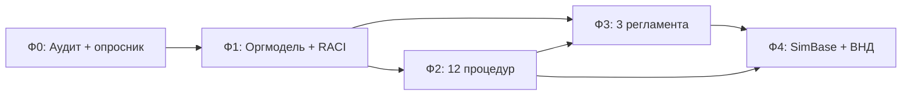

# Дорожная карта проекта трансформации ДУП

**Версия:** 1.0  
**Дата:** 03.09.2026  
**Горизонт:** 12 месяцев (5 фаз)  

---

## Обзор фаз

```
Фаза 0          Фаза 1           Фаза 2            Фаза 3           Фаза 4
Диагностика  →  Фундамент    →   Исполнение    →   Проектирование →  Цифра + TO-BE
(мес. 1)        (мес. 2–3)       (мес. 3–6)        (мес. 5–8)        (мес. 7–12)
     │               │                │                 │                 │
     ▼               ▼                ▼                 ▼                 ▼
 Аудит 1         Оргмодель        12 процедур       3 новых           SimBase
 филиала         RACI/ДИ          восстановлены     регламента        MVP + ВНД
 Опросник        SC запущен       Quick wins        Handover          KPI мониторинг
 Базовая линия   Пауза ДИ         Прогнозы          Gate продукта
```

---

## Фаза 0: Диагностика и базовая линия

**Срок:** месяц 1  
**Цель:** зафиксировать фактическое состояние (AS-IS) и получить данные для приоритизации  

### Ключевые результаты (deliverables)

| # | Результат | Владелец | Статус |
|---|-----------|----------|--------|
| 0.1 | Аудит 1 филиала по чек-листам методологии (стр. 889–907) | ГМП | 🔲 |
| 0.2 | Рассылка и сбор опросника директоров филиалов | PM + Зам. ДУП | 🔲 |
| 0.3 | Интервью с ДРБ (передача пакета, продукт) | PM | 🔲 |
| 0.4 | Интервью с Финблоком (ФЭМ, прогнозы, платежи) | PM | 🔲 |
| 0.5 | Интервью с Юр блоком (договоры, открытие филиала) | PM | 🔲 |
| 0.6 | Проверка статуса методологии (приказ 15.01.2021) | ГМП | 🔲 |
| 0.7 | Отчёт AS-IS + реестр узких мест (верифицированный) | PM | 🔲 |

### Процессы в фокусе

- Все 23 подпроцесса — инвентаризация (✅ реестр создан)
- 4.2 Аудит — пилот
- Сбор обратной связи филиалов

### Gate (критерий перехода к Фазе 1)

- [ ] Аудит 1 филиала завершён
- [ ] ≥ 70% директоров ответили на опросник
- [ ] Минимум 2 интервью с ЦО проведены
- [ ] Steering Committee утвердил приоритеты P1

---

## Фаза 1: Организационный фундамент

**Срок:** месяцы 2–3  
**Цель:** заложить управленческую структуру для трансформации  

### Ключевые результаты

| # | Результат | Владелец |
|---|-----------|----------|
| 1.1 | Утверждён состав Steering Committee | Директор ДУП |
| 1.2 | Назначен PM проекта трансформации | Директор ДУП |
| 1.3 | Таблица соответствия 21 роли навигатора → новая структура | ГМП |
| 1.4 | **Пауза утверждения ДИ** до сверки с п.3.5 методологии | HR + ДУП |
| 1.5 | Целевая оргсхема: 2 зама + ГМП + МП | Директор ДУП |
| 1.6 | Обновлённая RACI v2 (с владельцами ЦО) | ГМП |
| 1.7 | Письмо ДРБ: минимальный пакет передачи проекта | Директор ДУП |

### Процессы в фокусе

| Процесс | Действие |
|---------|----------|
| 3.1 Назначение куратора | Формализовать матрицу «филиал → куратор» |
| 4.1 Методология | Установить владельца ВНД, статус документов |
| 3.2 Открытие филиала | Назначить владельца (рабочая группа) |

### Gate → Фаза 2

- [ ] SC проведён, roadmap утверждён
- [ ] RACI v2 согласована с ДРБ и Финблоком
- [ ] Минимальный пакет ДРБ→ДУП письменно зафиксирован

---

## Фаза 2: Восстановление исполнения (12 процедур)

**Срок:** месяцы 3–6  
**Цель:** запустить исполнение существующих процедур методологии  

### Портфель инициатив

| ID | Процесс | Инициатива | Эффект |
|----|---------|------------|--------|
| 2.1 | 1.1 Приём пакета | Чек-лист + SLA 5 дней + эскалация | Быстрый старт проектов |
| 2.2 | 2.3 Прогнозы | Единый реестр, календарь (еженед./раз в 2 нед.) | Прозрачность финансов |
| 2.3 | 1.7 / Б.2 Закупки | Нормативы сроков + трекер эскалации | Сокращение задержек |
| 2.4 | 1.8 Статус-встречи | Регламент: частота, повестка, протокол | Управляемость |
| 2.5 | 2.7 Дефекты | Ежеквартальный сбор → маршрут в ТЗ/закупки | Снижение повторов |
| 2.6 | 1.5 ФЭМ | Ревизия нормативов (поверка, переносы) | Актуальные бюджеты |
| 2.7 | 1.9 Платежи | 3 потока ВУ/КИЗ/КОЗ — единая инструкция | Меньше задержек оплат |
| 2.8 | 4.2 Аудит | Масштабирование на 3 филиала | Контроль качества |
| 2.9 | 2.5 Переносы | Учёт факт vs ФЭМ, процедура согласования | Контроль бюджета |
| 2.10 | 5 Эскалация | Единый канал претензий внешних партнёров | Снижение обходных путей |

### Gate → Фаза 3

- [ ] ≥ 8 из 10 инициатив в промышленной эксплуатации
- [ ] Реестр прогнозов ведётся 2+ месяца подряд
- [ ] Аудит пройден на ≥ 3 филиалах

---

## Фаза 3: Проектирование пробелов (TO-BE)

**Срок:** месяцы 5–8  
**Цель:** закрыть 3 подлинных пробела и подготовить оргпереход  

### Новые регламенты

| # | Регламент | Процесс | Содержание |
|---|-----------|---------|------------|
| 3.1 | **Gate готовности продукта** | 1.2 | Критерии пилота, роли ДРБ/ДУП, подпись, блокировка старта |
| 3.2 | **Handover реализация → сопровождение** | 2.0 | Чек-лист, ответственные, дата, архив документов |
| 3.3 | **Открытие филиала** | 3.2 | Сквозной маршрут: Юр → HR → Фин → ДУП → филиал |

### Организационный переход

| # | Действие | Условие |
|---|----------|---------|
| 3.4 | Разделение замов (блок 1 / блок 2) | Handover 3.2 утверждён |
| 3.5 | Назначение / найм ГМП | RACI v2 утверждена |
| 3.6 | Утверждение ДИ (4 роли) | Сверка с п.3.5 методологии |
| 3.7 | Разведение отчётности 1.8 / 2.8 / 4.3 | Матрица «кто, что, кому, когда» |

### Gate → Фаза 4

- [ ] 3 регламента утверждены приказом/письмом
- [ ] Handover протестирован на 2 проектах
- [ ] Gate продукта применён на 1 новом проекте

---

## Фаза 4: Цифровая трансформация и устойчивость

**Срок:** месяцы 7–12  
**Цель:** закрепить изменения в системах и методологии  

### ИТ-инициативы

| # | Инициатива | Процессы | MVP |
|---|------------|----------|-----|
| 4.1 | Единая карточка проекта | 1.1, 1.3, 1.8 | Обязательные поля + блокировка без пакета |
| 4.2 | Автопрогноз | 2.3 | Шаблон + напоминания + дашборд |
| 4.3 | Уведомления | 1.7, 1.9, 2.4 | Контракты, платежи, просрочки |
| 4.4 | Интеграции | 1.7, 1.5 | Закупки ↔ 1С ↔ портфель |
| 4.5 | Сохранение Zabbix + Documentolog | 2.2, 1.1 | Карта зависимостей |

### Методология

| # | Действие |
|---|----------|
| 4.6 | Актуализация ВНД: роли вместо ФИО, глоссарий (ОСУ, КИЗ, КОЗ, ВУ) |
| 4.7 | Архивация 28% устаревшего (стр. 960–1313) |
| 4.8 | Единый реестр ВНД (живой, не Confluence-only) |
| 4.9 | Оценка собственной аккредитации для поверки (2.1) |

### Gate → Завершение

- [ ] KPI достигнуты (см. паспорт)
- [ ] TO-BE дерево процессов v5 утверждено
- [ ] Проект передан в операционное управление ПМО

---

## Сводная матрица: фазы × блоки процессов

| Блок | Ф0 | Ф1 | Ф2 | Ф3 | Ф4 |
|------|----|----|----|----|-----|
| 1. Реализация | Диагностика | Пакет ДРБ | 1.1, 1.5, 1.7, 1.8, 1.9 | 1.2 Gate | Карточка проекта |
| 2. Сопровождение | Опросник | — | 2.3, 2.5, 2.7 | 2.0 Handover | Автопрогноз |
| 3. Филиальная сеть | — | 3.1, 3.2 WG | — | 3.2 регламент | — |
| 4. ПМО | Аудит | RACI, роли | 4.2 аудит | 4.3 отчётность | ВНД, KPI |
| Б. Чужие | Интервью | Пакет ДРБ | Закупки, ФЭМ | Откр. филиала | Интеграции |

---

## Зависимости (критический путь)



**Критический путь:** Ф0 → Ф1 (RACI) → Ф2 (исполнение) → Ф3 (handover + gate) → Ф4 (цифра)

---

## Бюджет ресурсов (оценка)

| Ресурс | Ф0 | Ф1 | Ф2 | Ф3 | Ф4 |
|--------|----|----|----|----|-----|
| PM (1 FTE) | 100% | 100% | 80% | 60% | 40% |
| ГМП | 50% | 80% | 60% | 80% | 100% |
| Зам. ДУП | 20% | 40% | 30% | 50% | 20% |
| Директор ДУП | 10% | 20% | 10% | 20% | 10% |
| ИТ | — | — | 20% | 40% | 80% |
| Филиалы | 10% | — | 20% | 10% | 10% |
